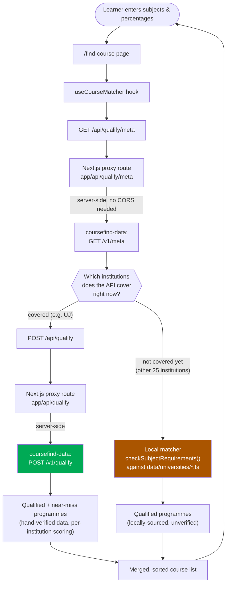

# CourseFinder SA

> Helping South African matric students find out which university courses they actually qualify for.

[](https://nextjs.org)
[](https://www.typescriptlang.org)
[](https://vercel.com)

---

## About

A learner types in their matric subjects and percentages; CourseFinder tells them which university programmes they qualify for, which they're just short of and why, and what else is available (extended-curriculum foundation years, TVET colleges) if a degree isn't within reach yet.

This repository is the **frontend** — the Next.js app learners actually use. It does **not** carry its own admission-matching logic for every institution any more: the eligibility check for institutions it has been verified against is delegated to a separate service, **[coursefind-data](https://github.com/itumeleng-itu/cf-data)**, over HTTP. See [Backend integration](#backend-integration-coursefind-data) below for exactly how that works, and why only *some* institutions go through it today.

### Features

- **Course matching** — subjects + percentages in, qualifying programmes out, with a specific reason shown for anything a learner just misses
- **Extended Curriculum Programmes** — foundation-year alternatives surfaced when a learner is below a degree's normal APS
- **TVET colleges** — an alternative pathway shown alongside university results
- **AI-assisted chat** — a study/course-guidance assistant (OpenRouter, Gemini models — see [`GOOGLE-AI-INTEGRATION.md`](./GOOGLE-AI-INTEGRATION.md))
- **Matric pass-rate statistics** — national and provincial, with year-over-year comparisons
- **Past papers** — NSC past papers and memoranda
- **Academic calendar** — application windows and other key dates

---

## Backend integration (coursefind-data)

Admission rules for South African universities are genuinely institution-specific — different APS formulas, different Home-Language/First-Additional-Language handling, different exceptions per faculty — and getting them right one institution at a time, verified against the actual prospectus, is the entire reason **[coursefind-data](https://github.com/itumeleng-itu/cf-data)** exists. This app used to reimplement that matching logic locally against its own bundled per-university data files; it now calls coursefind-data's API for whichever institutions it has verified data for, and only falls back to its own local data for the rest.



A few things worth knowing if you're touching this code:

- **The API call is server-side, not from the browser.** coursefind-data has no CORS configuration, so `app/api/qualify/route.ts` and `app/api/qualify/meta/route.ts` proxy the request from this app's own server — the browser only ever talks to this app's origin, and `QUALIFY_API_URL` (where coursefind-data is actually running) never reaches the client bundle.
- **Coverage is discovered, not hardcoded.** `lib/qualify-api.ts`'s `fetchCoveredInstitutions()` calls `/v1/meta` on every match attempt rather than assuming a fixed institution list. As coursefind-data onboards more institutions, this app picks them up automatically — no code change needed here.
- **If the API is unreachable**, an institution it's supposed to be authoritative for shows a visible error rather than silently falling back to (known-less-reliable) local data for it; every *other* institution is unaffected, since local matching for them never depended on the API being up in the first place.
- **Extended-curriculum and TVET-college matching are always local.** coursefind-data doesn't carry an "extended" flag or cover TVET colleges at all yet, so those two result lists use `checkSubjectRequirements()` against `data/universities/*.ts` / `data/colleges.ts` regardless of which institution is involved.
- **The two repos share no code or schema package.** `lib/qualify-api.ts`'s types and `lib/subject-slugs.ts`'s subject mapping are hand-mirrors of coursefind-data's Pydantic models and `Subject` enum respectively — each file says so in its own comment, and either one going stale relative to the other is a real risk nothing currently catches automatically.

---

## Tech stack

| Layer | Technology |
|---|---|
| Framework | **Next.js 16** (App Router, Turbopack), React 19, TypeScript |
| Styling | Tailwind CSS, shadcn/ui |
| Backend (this app) | Next.js API routes — proxies to coursefind-data, plus chat/news/stats endpoints |
| Backend (course matching) | **[coursefind-data](https://github.com/itumeleng-itu/cf-data)** — a separate FastAPI service; see above |
| AI chat | OpenRouter (Gemini models) |
| Storage (past papers, some assets) | Appwrite |
| Testing | Jest + ts-jest + Testing Library |
| Deployment | Vercel |

---

## Project structure

```
courseFinder/
├── app/
│   ├── api/
│   │   ├── qualify/             # Proxy to coursefind-data's /v1/qualify
│   │   │   ├── route.ts
│   │   │   └── meta/route.ts    # Proxy to coursefind-data's /v1/meta
│   │   ├── chat/                 # AI chat assistant
│   │   ├── matric-stats/, provincial-pass-rates/, nsc-2025/, news/
│   ├── find-course/               # The course-matching page + local matcher
│   │   ├── page.tsx
│   │   ├── utils.ts                # checkSubjectRequirements() -- local matching logic
│   │   └── types.ts
│   ├── calendar/, colleges/, matric-results/, past-papers/, study-tips/, universities/
│
├── hooks/
│   └── use-course-matcher.ts      # Orchestrates API vs local matching -- see diagram above
│
├── lib/
│   ├── qualify-api.ts              # coursefind-data API client (mirrors its response types)
│   ├── subject-slugs.ts            # Subject name -> coursefind-data slug mapping
│   ├── subject-aliases.ts          # Local subject-name normalisation (HL/FAL parsing etc.)
│   ├── aps-calculator.ts, aps/     # Per-institution APS formulas (used by local matching only)
│   └── utils/subject-validator.ts  # Subject-picker conflict rules (one HL, one FAL, etc.)
│
├── data/
│   ├── universities/                # 26 institutions' locally-sourced course data
│   └── colleges.ts                  # TVET college data
│
└── __tests__/                       # Jest test suite
```

---

## Getting started

### Prerequisites

- Node.js 18+
- A running **[coursefind-data](https://github.com/itumeleng-itu/cf-data)** instance if you want the main course list to use real backend data (`uv run uvicorn app.main:app --reload` from that repo, or point at a deployed instance) — without one, the API-covered institution(s) will show a visible error and every other institution still works from local data

### Installation

```bash
git clone https://github.com/itumeleng-itu/courseFinder.git
cd courseFinder
npm install

cp .env.example .env.local
# QUALIFY_API_URL defaults to http://localhost:8000 -- point it at coursefind-data
# if it's running somewhere else. See .env.example for the full comment.

npm run dev
# → http://localhost:3000
```

### Environment variables

| Variable | Required? | Purpose |
|---|---|---|
| `QUALIFY_API_URL` | No — defaults to `http://localhost:8000` | Where coursefind-data's API is running. Server-side only, see [Backend integration](#backend-integration-coursefind-data). |
| `OPENROUTER_API_KEY` | For the AI chat feature | See [`GOOGLE-AI-INTEGRATION.md`](./GOOGLE-AI-INTEGRATION.md) |
| Appwrite variables | For past-papers storage | See [`SYSTEM_DOCUMENTATION.md`](./SYSTEM_DOCUMENTATION.md) |

### Testing

```bash
npm run test              # run once
npm run test:watch        # watch mode
npm run test:coverage     # with coverage
```

---

## Documentation

| Document | Covers |
|---|---|
| [`SYSTEM_DOCUMENTATION.md`](./SYSTEM_DOCUMENTATION.md) | Full system architecture, including what was removed and why |
| [`API_REFERENCE.md`](./API_REFERENCE.md) | This app's own API routes |
| [`GOOGLE-AI-INTEGRATION.md`](./GOOGLE-AI-INTEGRATION.md) | The AI chat assistant |
| [`YEARLY-CACHING.md`](./YEARLY-CACHING.md) | How yearly stats data is cached |
| [`DATA-SOURCES.md`](./DATA-SOURCES.md) | Where the locally-sourced university/college data came from |
| [`API-DEBUGGING-SUMMARY.md`](./API-DEBUGGING-SUMMARY.md) | Troubleshooting notes |
| **[coursefind-data's README](https://github.com/itumeleng-itu/cf-data)** | The backend this app calls for course matching |

---

## Related repository

**[coursefind-data](https://github.com/itumeleng-itu/cf-data)** — the admission-matching API and hand-verified programme dataset this app calls for eligibility checking. Start there to understand how a programme's requirements get verified, how APS scoring actually works per institution, or to add a new institution's data.
